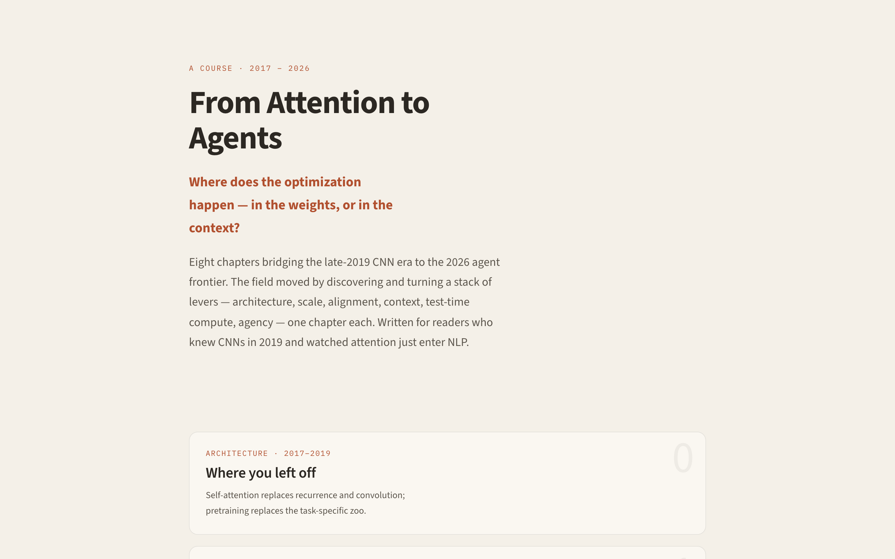
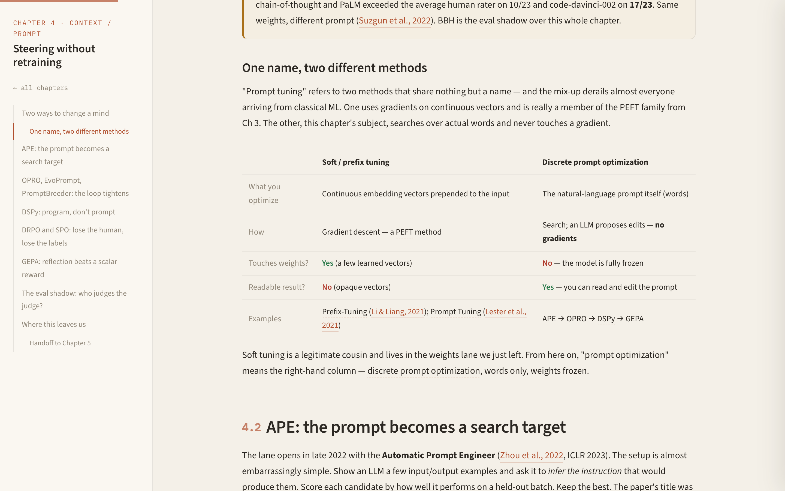

<p align="center">
  
</p>

<h1 align="center">From Attention to Agents</h1>

<p align="center">
  How modern AI happened, from the 2017 Transformer to 2026 reasoning agents.
</p>

<p align="center">
  
  
  
  
</p>

---

Most explanations of modern AI are either a pop-science blur or a stack of disconnected papers. This is the path between: one continuous story for someone who knew CNNs and watched attention arrive in NLP around 2019, and wants the rest of it - RLHF, DPO, GRPO, RLVR, reasoning models, agents, evals - as a single arc rather than a reading list.

The through-line is one question: **where does the optimization happen - in the weights, or in the context?** Twelve chapters, each turning one lever, every claim cited to its primary source, with live interactive demos.

## The arc

| # | Chapter | Era | The lever it turns |
|---|---------|-----|--------------------|
| 0 | Where you left off | 2017 - 2019 | Architecture: the Transformer, BERT vs GPT, tokenization |
| 1 | Scale is a strategy | 2020 - 2022 | Scale: GPT-3, scaling laws, Chinchilla, data-wall, ViT/CLIP |
| 2 | Inside a modern pretraining run | 2023 - 2026 | Efficiency: data pipelines, MoE, MLA/GQA, RoPE + YaRN, FP8, Muon |
| 3 | Teaching it to be helpful | 2022 | Alignment: RLHF, ChatGPT, Constitutional AI, CoT seed |
| 4 | The recipe gets cheaper | 2023 - 2026 | Democratization: DPO family, GRPO, LoRA/QLoRA, Tulu 3, RLVR |
| 5 | Steering without retraining | 2022 - 2026 | Context: APE, OPRO, DSPy, GEPA |
| 6 | Learning to think | 2024 - 2026 | Test-time compute: o1, R1, reasoning wave, hybrid thinking |
| 7 | Reinforcement learning grows up | 2025 - 2026 | Reward: Dr. GRPO, DAPO, GSPO, CISPO, rubric rewards, RL infra |
| 8 | Paying for thought | 2023 - 2026 | Inference systems: PagedAttention, speculative decoding, quantization |
| 9 | Learning to act | 2024 - 2026 | Agency: tool use, ReAct, MCP, computer use, coding agents |
| 10 | Measuring what we built | 2020 - 2026 | Measurement + trust: 2026 evals, SAEs, safety frameworks |
| 11 | Computational cognition | 2026 | Synthesis of all eleven levers, plus a voice-tool capstone |

## Threads that run through it

What makes it a story instead of a timeline - motifs that recur and pay off across chapters:

- **Chain-of-thought, three times:** a prompt trick in Ch3, a prompt-optimization target in Ch5, then trained straight into the weights in Ch6.
- **The cost curve:** every advance gets cheaper and more open. RLHF -> DPO -> GRPO. Full fine-tune -> LoRA -> QLoRA. Closed -> LLaMA -> DeepSeek -> Kimi.
- **The eval shadow:** how we measure progress (BBH -> MMLU -> SWE-bench -> LLM-as-judge -> HLE) culminates in Ch10, with Goodhart's law as the recurring villain.
- **Multimodality underneath:** it surfaces where it matters (ViT/CLIP early, native-multimodal models late) instead of taking its own chapter.

## What's inside

- **Live demos, not pictures of demos:** PPO vs DPO vs GRPO side by side, a propose→score→select prompt search, reflective evolution on a Pareto frontier, a pairwise→Elo leaderboard.
- **A glossary sidebar:** click any underlined term for a first-principles nugget plus links to the primary sources, without losing your scroll position.
- **Cited, not vibes:** every date and figure links to arXiv, ACL, or the original report.
- **Read it either way:** drop into a single chapter, or follow the prev/next arc end to end.
- **Calm by design:** light warm-paper, all-sans, low-stimulation. Color is rare, so it carries meaning.

<p align="center">
  
</p>
<p align="center"><sub>Chapter 5, <i>Steering without retraining</i>: sidebar TOC, cited prose, and a compare-and-contrast table.</sub></p>

## Run locally

Plain HTML, CSS, and vanilla JS. No build step, no dependencies. KaTeX and Google Fonts load from a CDN, so `file://` won't work - serve the folder:

```bash
python3 -m http.server 8000   # then open http://localhost:8000
```

## Building on it

Architecture, design tokens, and how to add a chapter live in **[CLAUDE.md](CLAUDE.md)** - the onboarding doc for humans and agents working on the site.

## License

MIT. See [LICENSE](LICENSE).
